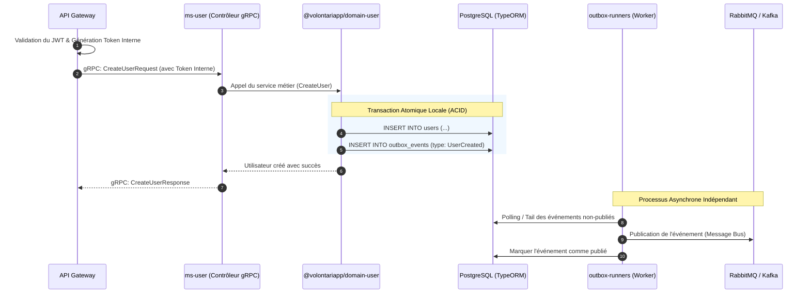

# Architecture & Design Document (ms-user & domain-user)

## Architecture Overview

L'architecture du périmètre "User" repose sur un découplage fort selon les principes du **Domain-Driven Design (DDD)** et de l'**Event-Driven Architecture**.

Le microservice `ms-user` n'est en réalité qu'une coquille (la couche d'infrastructure et de présentation gRPC). Le véritable cœur métier se trouve encapsulé dans la librairie interne `@volontariapp/domain-user` (publiée via le monorepo `npm-packages`). Cette séparation stricte garantit une réutilisabilité maximale et une forte cohésion du domaine.

## Directory Structure

### 1. Structure du Microservice (`ms-user`)

```text
ms-user/
├── src/
│   ├── config/          # Fichiers de configuration (TypeORM, gRPC)
│   ├── grpc/            # Contrôleurs gRPC implémentant les contrats de proto-registry
│   ├── modules/         # Modules NestJS pour l'injection de dépendances
│   └── main.ts          # Point d'entrée de l'application (bootstrap)
```

### 2. Structure du Domaine (`domain-user` dans `npm-packages`)

```text
npm-packages/packages/domain-user/
├── src/
│   ├── entities/        # Entités de domaine (ex: User)
│   ├── value-objects/   # Objets-valeurs garantissant la validité métier intrinsèque
│   ├── repositories/    # Interfaces et implémentations de l'accès aux données (TypeORM)
│   ├── services/        # Cas d'usage et logique métier (Domain Services)
│   └── domain-user.module.ts # Module prêt à l'emploi à importer dans l'application NestJS
```

## Data Flow & Component Communication

La séquence ci-dessous illustre le cycle de vie d'une requête de création d'utilisateur et l'application du pattern Outbox pour la notification asynchrone.



## Design Decisions & Trade-offs

### 1. Séparation de la logique métier (`domain-user` en librairie NPM)

- **Décision** : Extraire toute la logique (Entities, Repositories, Services) en dehors du microservice `ms-user` dans `@volontariapp/domain-user`.
- **Raison (DRY)** : Ce découpage permet à des environnements isolés, comme les `post-processors-runner` (ex: `post-processor-user`), d'importer le domaine et de manipuler les entités de manière stricte sans avoir besoin de faire des appels réseau (HTTP/gRPC) coûteux ou de dupliquer la logique métier.
- **Compromis** : Un cycle de développement légèrement rallongé (nécessite de publier/builder le package NPM localement lors de développements cross-repo).

### 2. Le Token Interne et la Délégation RBAC

- **Décision** : L'API Gateway gère entièrement le contrôle d'accès (RBAC) et injecte un "Token Interne" enrichi (comprenant les rôles) dans les métadonnées de la requête gRPC vers `ms-user`.
- **Raison** : Centraliser la sécurité et décharger le microservice de la vérification complexe des autorisations. `ms-user` part du principe que si la requête arrive avec un Token Interne valide, l'API Gateway a déjà validé les droits (Zero-Trust interne mitigé par réseau sécurisé).

### 3. Implémentation du Pattern Outbox

- **Décision** : Utiliser la table Outbox et les `outbox-runners` dédiés plutôt que de publier directement sur le Message Broker (RabbitMQ) depuis `ms-user`.
- **Raison** : Éviter les problèmes de la "Double Écriture" (Dual Write) sans recourir à un protocole complexe de commit à deux phases (2PC). Si la base de données commit la transaction, l'événement est garanti d'être publié éventuellement par le runner (Eventual Consistency).
- **Compromis** : Introduit un léger délai de latence entre la création de l'utilisateur et la publication de l'événement sur le réseau, ainsi qu'une infrastructure additionnelle (polling workers).
